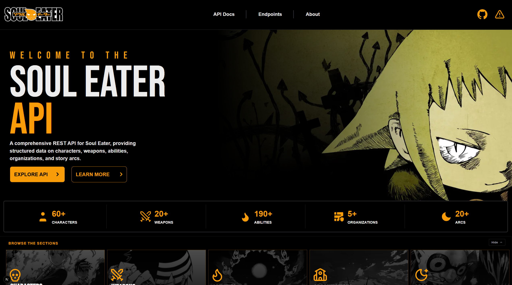
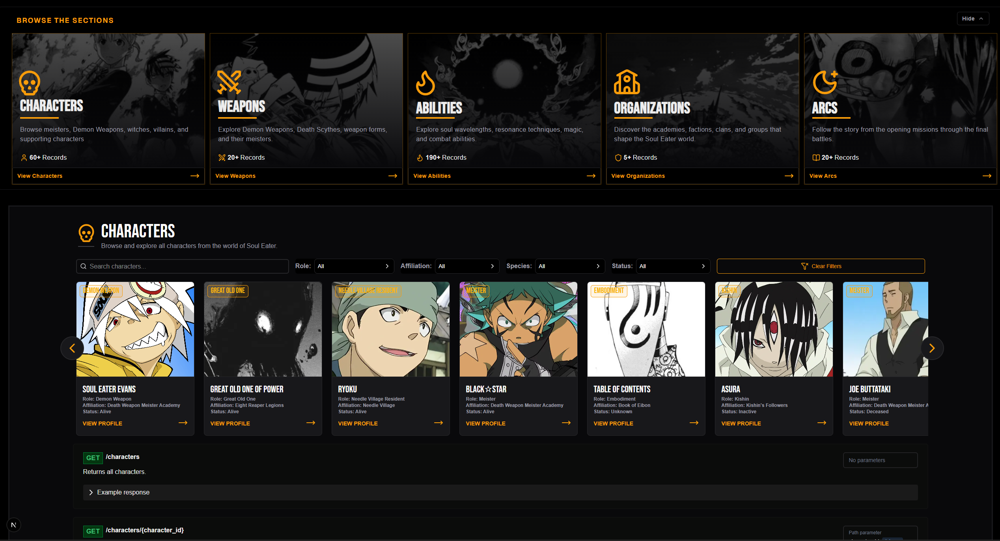
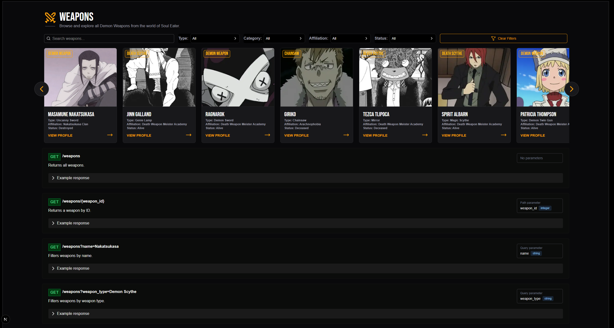
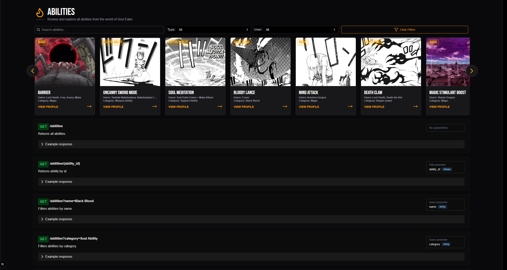
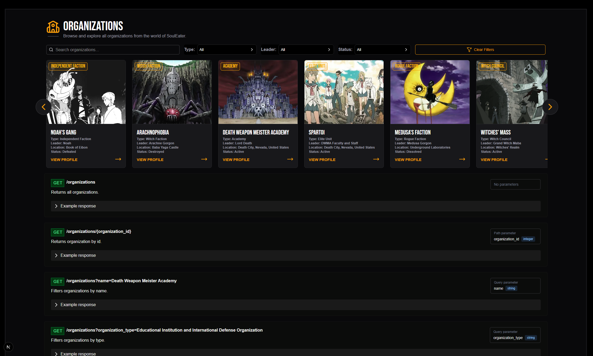
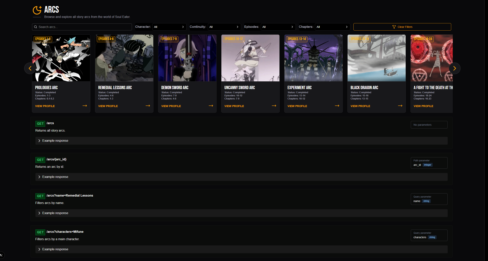
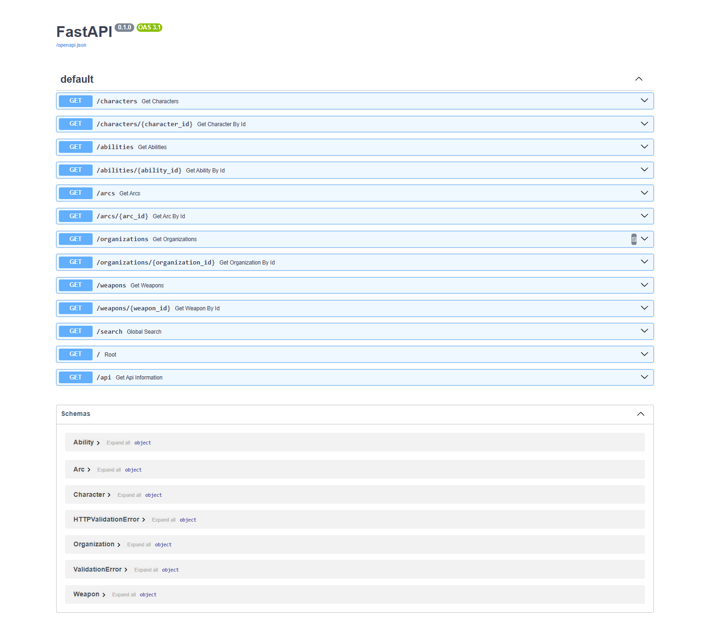

# Soul Eater API

A REST API and web application built for the Soul Eater anime and manga series. The project provides structured information on characters, Demon Weapons, abilities, organizations, and story arcs through a FastAPI backend with an interactive Next.js frontend.

## Live Demo

Frontend:
https://soul-eater-api.vercel.app

API Documentation:
https://soul-eater-api.onrender.com/docs

---

## Features

- Browse characters, weapons, abilities, organizations, and story arcs
- Search and filter records by different fields
- Interactive API documentation with FastAPI Swagger UI
- Example responses for every endpoint
- Responsive interface for desktop and mobile
- Report Issue and About modals
- Organized into reusable React components

---

## Screenshots

### Homepage



---

### Characters



---

### Weapons



---

### Abilities



---

### Organizations



---

### Story Arcs



---

### API Documentation



---

## API Endpoints

### Characters

- GET `/characters`
- GET `/characters/{character_id}`
- GET `/characters?name=`
- GET `/characters?role=`
- GET `/characters?affiliation=`
- GET `/characters?species=`
- GET `/characters?status=`

### Weapons

- GET `/weapons`
- GET `/weapons/{weapon_id}`
- GET `/weapons?name=`
- GET `/weapons?weapon_type=`
- GET `/weapons?weapon_category=`
- GET `/weapons?affiliation=`
- GET `/weapons?status=`

### Abilities

- GET `/abilities`
- GET `/abilities/{ability_id}`
- GET `/abilities?name=`
- GET `/abilities?category=`
- GET `/abilities?user=`

### Organizations

- GET `/organizations`
- GET `/organizations/{organization_id}`
- GET `/organizations?name=`
- GET `/organizations?organization_type=`
- GET `/organizations?leader=`
- GET `/organizations?status=`

### Story Arcs

- GET `/arcs`
- GET `/arcs/{arc_id}`
- GET `/arcs?name=`
- GET `/arcs?characters=`
- GET `/arcs?continuity=`
- GET `/arcs?episodes=`
- GET `/arcs?chapters=`

### Global Search

- GET `/search`

---

## Built With

### Backend

- Python
- FastAPI
- SQLModel
- SQLAlchemy
- Uvicorn

### Frontend

- Next.js
- React
- TypeScript
- Tailwind CSS
- Lucide React

### Deployment

- Vercel
- Render

---

## Running Locally

### Clone the repository

```bash
git clone https://github.com/Jenushan44/soul-eater-api.git
cd soul-eater-api
```

### Backend

```bash
cd backend

python -m venv venv

venv\Scripts\activate

pip install -r requirements.txt

uvicorn app.main:app --reload
```

The backend will run at:

```
http://127.0.0.1:8000
```

---

### Frontend

Create a `.env.local` file inside the `frontend` folder.

```
NEXT_PUBLIC_API_URL=http://127.0.0.1:8000
```

Then run:

```bash
cd frontend

npm install

npm run dev
```

The frontend will run at:

```
http://localhost:3000
```

---

## Future Improvements

- Expand the database with additional Soul Eater characters and weapons
- Add more advanced filtering options
- Improve search performance

---
